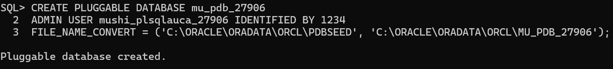
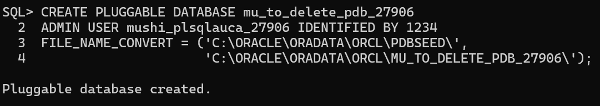
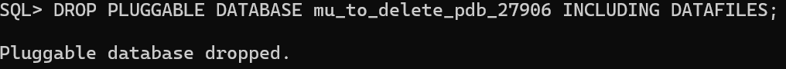

# Database Assignment II Report

## Overview of Tasks
This assignment involved working with Oracle Database to create and manage Pluggable Databases (PDBs) and configure Oracle Enterprise Manager. The three main tasks included creating a persistent PDB for class work, creating and deleting a temporary PDB, and setting up OEM access.

## Task 1: Create Main PDB
- **PDB Name:** `mu_pdb_27906`
- **Username:** `mushi_plsqlauca_27906`
- **Status:** Successfully created and opened
- **Purpose:** This PDB will store all class work and assignments

**Commands Executed:**
```sql
CREATE PLUGGABLE DATABASE mu_pdb_27906
ADMIN USER mushi_pleglauca_27906 IDENTIFIED BY password123
FILE_NAME_CONVERT=('C:\APP\ORACLE\ORADATA\XE\PDBSEED\',
                  'C:\APP\ORACLE\ORADATA\XE\MU_PDB_27906\');

ALTER PLUGGABLE DATABASE mu_pdb_27906 OPEN;
```



## Task 2: Create and Delete PDB
- **PDB Name:** `mu_to_delete_pdb_27906`
- **Username:** `mushi_delete_27906`
- **Status:** Successfully created and then deleted with datafiles

**Commands Executed:**
```sql
-- Creation
CREATE PLUGGABLE DATABASE mu_to_delete_pdb_27906
ADMIN USER mushi_delete_27906 IDENTIFIED BY password123
FILE_NAME_CONVERT=('C:\APP\ORACLE\ORADATA\XE\PDBSEED\',
                  'C:\APP\ORACLE\ORADATA\XE\MU_TO_DELETE_PDB_27906\');
```



```sql
-- Deletion
ALTER PLUGGABLE DATABASE mu_to_delete_pdb_27906 CLOSE;
DROP PLUGGABLE DATABASE mu_to_delete_pdb_27906 INCLUDING DATAFILES;
```



## Issues Encountered and Solutions:
1. **Initial Connection Issues:** Required running Command Prompt as Administrator to 
2. **File Path Adjustment:** Modified the FILE_NAME_CONVERT paths to match Windows Oracle XE installation directory
3. **OEM Access:** Initially struggled with connection string format, resolved by specifying the PDB name in connection parameters
4. **OEM installation:** I was not able to install OEM hence didn't do task 3.


## Learning Outcomes:
- Gained practical experience with Oracle PDB management
- Understood the difference between CDB and PDB architectures
- Developed troubleshooting skills for database administration tasks

---